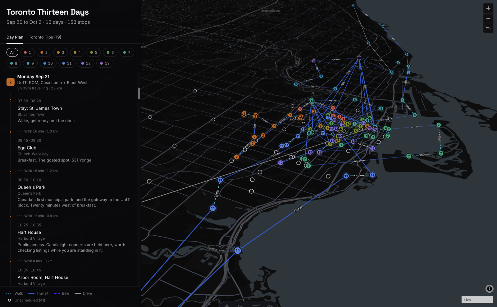

# trip-mapper

Plan a trip in one JSON file. Generates a day-coded map and itinerary you can
pan, filter by day and read stop by stop.



## Run it locally

Needs [Node](https://nodejs.org) 22 or newer.

```bash
git clone https://github.com/CPollreis/trip-mapper.git
cd trip-mapper
npm install
npm run dev
```

Then open **http://localhost:4321/trip-mapper**.

The `/trip-mapper` path is not optional. The site deploys to GitHub Pages under
a repo subpath, so `base` is set in `astro.config.mjs` and dev honours it too.
Plain `http://localhost:4321/` returns a 404.

The dev server rebuilds when you save and reloads the tab, so you can edit the
trip file in one window and watch the map change in the other.

| command | what it does |
|---|---|
| `npm run dev` | build, serve, watch, live reload |
| `npm run build` | type-check and build the static site into `dist/` |
| `npm run preview` | serve the built `dist/` |
| `npm run trips` | list your trip files |
| `npm run scan` | check tracked files for personal data, showing any matches |

## Start a trip

```bash
npm run new-trip -- --city lisbon --start 2027-04-02 --end 2027-04-09
```

Writes `trips/lisbon-2027-04.json` with every day laid out and coloured. Then
fill in `places` and `days[].items`. Field reference is in `schema.md`.

**Mark your own fixed events** with `"locked": true` so the plan is built around
them rather than over them.

**A new city works right away.** The map draws your pins with no reference
geography behind them. To add coastline and transit lines, create
`cities/<slug>.json`; `cities/toronto.json` is the worked example.

## Keeping private details out of git

This repo is public, so the rule it enforces is that locations and times are
publishable and every other personal detail is not.

**`resources/`** is for your own files: tickets, receipts, confirmations.
Everything you put there is gitignored and stays on your machine.

**`resources/private.json`** overrides fields on the matching place at build
time, so the committed trip file can hold a neighbourhood while your local
build has the real address:

```json
{ "places": { "stay-01": {
    "name": "Stay: 12 Example St", "address": "12 Example St",
    "lat": 12.3456, "lon": -65.4321 } } }
```

Two guards back this up. `scripts/scan-personal.mjs` fails the build on contact
details, booking references, door codes and payment fragments; run it yourself
with `npm run scan`. `scripts/guard-public.mjs` refuses to produce a public
bundle while any `resources/` file is on disk, which is why the deploy workflow
builds from a clean CI checkout rather than from your local `dist/`.

Build output lands in `dist/` and is gitignored.
